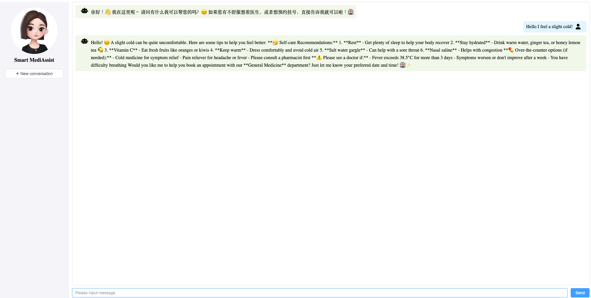

<div align="center">



# LangChain4J-SmartMed Agent


**[English](#english-version) | [中文](#中文版本)**

</div>

---

<a name="english-version"></a>
<details open>
<summary><h2>🇺🇸 English (Click to expand/collapse)</h2></summary>

## 1. Project Overview

This project, named **"SmartMed Agent"**, is an AI chat assistant application built on the Java technology stack and the LangChain4J framework. Its core goal is to leverage the capabilities of Large Language Models (LLMs), combined with local knowledge bases and external tools, to provide intelligent Q&A and auxiliary services focused on the medical domain. The project adopts a front-end and back-end separated architecture: the back-end uses the Spring Boot framework and deeply integrates the LangChain4J library to achieve interactions with large models, memory management, tool invocation (function calling), and Retrieval-Augmented Generation (RAG). The front-end is built with Vue.js for user interaction.

According to the project documentation, this appears to be an educational or demonstration project aimed at showcasing how to use LangChain4J to integrate large model capabilities into Java applications, particularly for medical scenarios. The project configuration uses Alibaba Cloud's Bailian Platform (DashScope) with the Tongyi Qianwen (Qwen) series models, while also demonstrating how to access other models (such as DeepSeek) and locally deployed models (via Ollama).

## 2. Technology Stack

**Backend:**

- **Core Framework:** Spring Boot 3.2.6
- **AI Framework:** LangChain4J 1.0.0-beta3
- **Language:** Java 17
- **Build Tool:** Maven
- **Databases:**
  - MySQL (using Mybatis-Plus for operations, storing business data such as appointment information)
  - MongoDB (storing chat memory)
- **LLM Platform:** Alibaba Cloud Bailian (DashScope), supporting Qwen series models; OpenAI-compatible interfaces also mentioned (usable for DeepSeek, etc.)
- **API Documentation:** Knife4j
- **Others:** Spring WebFlux (for streaming responses), Reactor

**Frontend:**

- **Framework:** Vue.js
- **Build Tool:** Vite
- **UI Component Library:** Element Plus

## 3. Project Structure

The project mainly contains the following modules:

- **`backend/`:** Backend Spring Boot + LangChain4J core module
- **`frontend/xiaozhi-ui/`:** Frontend Vue.js application module
- **`knowledge/`:** Stores local knowledge base files for RAG (in .md, .pdf, .txt formats)

### 3.1 Backend (`backend/`) Structure

The backend follows a typical Spring Boot project structure:

- **`src/main/java/org/example`:** Java source code root directory
  - `XiaozhiApp.java`: Spring Boot application startup class
  - `assistant`: Contains LangChain4J AI service interfaces
    - `XiaozhiAgent.java`: Core AI service interface configured with `@AiService` annotation for models, memory, tools, and RAG
  - `bean`: Data Transfer Objects (DTOs), such as `ChatForm`, `ChatMessages`
  - `config`: Spring configuration classes for LangChain4J components like EmbeddingStore, ChatMemoryProvider
  - `controller`: Spring MVC controllers
    - `XiaozhiController.java`: Provides `/xiaozhi/chat` API endpoint, receives user messages and calls `XiaozhiAgent`
  - `entity`: JPA/Mybatis-Plus entity classes mapping database tables
  - `mapper`: Mybatis-Plus Mapper interfaces
  - `service`: Business logic service layer
  - `store`: Data storage implementations
    - `MongoChatMemoryStore.java`: MongoDB implementation of LangChain4J's `ChatMemoryStore`
  - `tools`: LangChain4J tools for function calling
    - `AppointmentTools.java`: Appointment-related tools for LLM
    - `CalculatorTools.java`: Calculator tools for LLM
- **`src/main/resources`:** Resource files
  - `application.properties`: Spring Boot configuration
  - `*.txt`: LangChain4J prompt template files

### 3.2 Frontend (`xiaozhi-ui/`) Structure

- **`public`:** Static assets
- **`src`:** Frontend source code
  - `main.js`: Vue application entry
  - `App.vue`: Root component
  - `components`: Reusable Vue components
    - `ChatWindow.vue`: Core chat window interface
  - `assets`: Images, styles
- **`index.html`:** HTML entry
- **`package.json`:** Node.js configuration
- **`vite.config.js`:** Vite configuration

## 4. Core Features

### 4.1 AI Interaction Core (`XiaozhiAgent`)

```java
@AiService(
        wiringMode = AiServiceWiringMode.EXPLICIT,
        streamingChatModel = "qwenStreamingChatModel",
        chatMemoryProvider = "chatMemoryProviderXiaozhi",
        tools = "appointmentTools",
        contentRetriever = "contentRetrieverXiaozhiPincone"
)
public interface XiaozhiAgent {
    @SystemMessage(fromResource = "xiaozhi-prompt-template.txt")
    Flux<String> chat(@MemoryId Long memoryId, @UserMessage String userMessage);
}
```

**Features:**
- **Model Integration:** Configured with `qwenStreamingChatModel` for streaming chat
- **Streaming Output:** Returns `Flux<String>` with Spring WebFlux for real-time responses
- **Chat Memory:** Uses MongoDB for persistent conversation history with `@MemoryId`
- **Function Calling:** Integrates `AppointmentTools` for LLM to call Java methods
- **RAG:** Content retriever for knowledge base queries
- **System Prompt:** External template file for AI behavior configuration

### 4.2 API Endpoint (`SmartMedController`)

Provides RESTful API endpoint `/smartmed/chat` (POST) receiving `ChatForm` with `memoryId` and `message`, returning streaming response.

### 4.3 Knowledge Base & RAG

The `knowledge` directory contains medical documents (.md, .pdf, .txt). The RAG process:

1. **Document Loading & Splitting:** Using LangChain4J's `DocumentLoader` and `DocumentSplitter`
2. **Vectorization:** Using `text-embedding-v3` to convert text to vectors
3. **Vector Storage:** Stored in Pinecone or local vector database
4. **Retrieval:** Similarity search based on user query vectors
5. **Augmentation:** Retrieved context injected into prompts
6. **Generation:** LLM generates answers based on context

### 4.4 Function Calling (`AppointmentTools`)

```java
public class AppointmentTools {
    @Tool("Query available appointment slots for specified date and department")
    public List<String> findAvailableSlots(String date, String department) {
        return appointmentService.getAvailableSlots(date, department);
    }

    @Tool("Create appointment for user")
    public String createAppointment(String patientName, String date, String time, String department) {
        return appointmentService.createAppointment(patientName, date, time, department);
    }
}
```

### 4.5 Frontend Interaction (`ChatWindow.vue`)

- Displays chat interface with user messages and AI responses
- Receives user input
- Calls backend `/xiaozhi/chat` API
- Handles streaming responses
- Manages session with `memoryId`

## 5. Configuration

### 5.1 Key Configuration (`application.properties`)

- `server.port`: Backend port (8080)
- `langchain4j.community.dashscope.*`: Bailian API Key and model names (qwen-max, qwen-plus, text-embedding-v3)
- `spring.data.mongodb.uri`: MongoDB connection for chat memory
- `spring.datasource.*`: MySQL connection for business data

### 5.2 Main Dependencies (`pom.xml`)

- `spring-boot-starter-web`: Spring Boot Web
- `knife4j-openapi3-jakarta-spring-boot-starter`: API docs
- `langchain4j-community-dashscope-spring-boot-starter`: Bailian integration
- `langchain4j-spring-boot-starter`: Core LangChain4J
- `spring-boot-starter-data-mongodb`: MongoDB support
- `mybatis-plus-spring-boot3-starter`: Mybatis-Plus
- `langchain4j-pinecone`: Pinecone vector DB
- `spring-boot-starter-webflux`: Reactive programming

## 6. Summary

LangChain4J-SmartMed Agent is a comprehensive AI assistant demonstration project effectively showcasing how to build LLM-integrated applications in Java (Spring Boot) using the LangChain4J framework. It covers:

- **Multi-model Support:** Flexible configuration for different LLMs (Bailian Qwen, DeepSeek, etc.)
- **AI Service Abstraction:** Simplified LLM interaction with `@AiService`
- **Streaming Output:** Real-time chat experience
- **Persistent Chat Memory:** MongoDB for context-aware conversations
- **Tool Invocation:** LLM interaction with external systems via Java
- **RAG:** Domain-specific knowledge Q&A through vector database integration

This project provides an excellent starting point and reference for learning and practicing large model technology in the Java ecosystem, especially in domains like healthcare requiring specific knowledge and tools.

</details>

---

<a name="中文版本"></a>
<details>
<summary><h2>🇨🇳 中文版本 (点击展开/收起)</h2></summary>

## 1. 项目概述

本项目名为 **"SmartMed Agent"**，是一个基于 Java 技术栈和 LangChain4J 框架构建的 AI 聊天助手应用。其核心目标是利用大型语言模型（LLM）的能力，结合本地知识库和外部工具，提供一个专注于医疗领域的智能问答和辅助服务。项目采用了前后端分离的架构，后端使用 Spring Boot 框架，深度集成了 LangChain4J 库来实现与大模型的交互、记忆管理、工具调用（函数调用）以及检索增强生成（RAG）等功能。前端则采用 Vue.js 构建用户交互界面。

根据项目文档，该项目似乎是一个教学或演示项目，旨在展示如何使用 LangChain4J 将大模型能力集成到 Java 应用中，特别是针对医疗场景。项目配置使用了阿里云的百炼平台（DashScope）提供的通义千问（Qwen）系列模型，同时也展示了如何接入其他模型（如 DeepSeek）以及本地部署模型（通过 Ollama）。

## 2. 技术栈

**后端:**

- **核心框架:** Spring Boot 3.2.6
- **AI 框架:** LangChain4J 1.0.0-beta3
- **语言:** Java 17
- **构建工具:** Maven
- **数据库:**
  - MySQL (使用 Mybatis-Plus 操作，存储如预约信息等业务数据)
  - MongoDB (存储聊天记忆)
- **大模型平台:** 阿里云百炼 (DashScope)，支持 Qwen 系列模型，配置中也提到了 OpenAI 兼容接口（可用于 DeepSeek 等）
- **API 文档:** Knife4j
- **其他:** Spring WebFlux (用于流式响应), Reactor

**前端:**

- **框架:** Vue.js
- **构建工具:** Vite
- **UI 组件库:** Element Plus

## 3. 项目结构

项目主要包含以下几个模块：

- **`backend/`:** 后端 Spring Boot + LangChain4J 核心模块
- **`frontend/xiaozhi-ui/`:** 前端 Vue.js 应用模块
- **`knowledge/`:** 存放用于 RAG 的本地知识库文件（包含 .md, .pdf, .txt 格式）

### 3.1 后端 (`backend/`) 结构

后端遵循典型的 Spring Boot 项目结构：

- **`src/main/java/org/example`:** Java 源代码根目录
  - `XiaozhiApp.java`: Spring Boot 应用启动类
  - `assistant`: 包含 LangChain4J 的 AI 服务接口
    - `XiaozhiAgent.java`: 核心 AI 服务接口，使用 `@AiService` 注解配置模型、记忆、工具和 RAG
  - `bean`: 数据传输对象 (DTO)，如 `ChatForm`, `ChatMessages`
  - `config`: Spring 配置类，用于配置 LangChain4J 组件
  - `controller`: Spring MVC 控制器
    - `XiaozhiController.java`: 提供 `/xiaozhi/chat` API 端点
  - `entity`: JPA/Mybatis-Plus 实体类
  - `mapper`: Mybatis-Plus Mapper 接口
  - `service`: 业务逻辑服务层
  - `store`: 数据存储相关实现
    - `MongoChatMemoryStore.java`: 使用 MongoDB 实现 LangChain4J 的 `ChatMemoryStore`
  - `tools`: LangChain4J 工具类，用于函数调用
    - `AppointmentTools.java`: 提供预约相关的工具方法
    - `CalculatorTools.java`: 提供计算器工具方法

### 3.2 前端 (`xiaozhi-ui/`) 结构

- **`public`:** 静态资源目录
- **`src`:** 前端源代码目录
  - `main.js`: Vue 应用入口文件
  - `App.vue`: 根组件
  - `components`: 可复用的 Vue 组件
    - `ChatWindow.vue`: 核心的聊天窗口界面组件
  - `assets`: 存放图片、样式等资源
- **`index.html`:** HTML 入口文件
- **`package.json`:** Node.js 项目配置
- **`vite.config.js`:** Vite 配置文件

## 4. 核心功能

### 4.1 AI 交互核心 (`XiaozhiAgent`)

```java
@AiService(
        wiringMode = AiServiceWiringMode.EXPLICIT,
        streamingChatModel = "qwenStreamingChatModel",
        chatMemoryProvider = "chatMemoryProviderXiaozhi",
        tools = "appointmentTools",
        contentRetriever = "contentRetrieverXiaozhiPincone"
)
public interface XiaozhiAgent {
    @SystemMessage(fromResource = "xiaozhi-prompt-template.txt")
    Flux<String> chat(@MemoryId Long memoryId, @UserMessage String userMessage);
}
```

**功能特点：**
- **模型集成:** 配置了 `qwenStreamingChatModel` 作为流式聊天模型
- **流式输出:** 返回 `Flux<String>`，结合 Spring WebFlux 实现实时响应
- **聊天记忆:** 使用 MongoDB 持久化对话历史，通过 `@MemoryId` 维护独立会话
- **工具调用:** 集成 `AppointmentTools` 供 LLM 调用 Java 方法
- **RAG:** 内容检索器用于知识库查询
- **系统提示:** 外部模板文件配置 AI 行为

### 4.2 API 端点 (`XiaozhiController`)

提供 RESTful API 端点 `/xiaozhi/chat` (POST)，接收包含 `memoryId` 和 `message` 的 `ChatForm`，返回流式响应。

### 4.3 知识库与 RAG 实现

`knowledge` 目录包含医疗相关文档（.md, .pdf, .txt）。RAG 流程：

1. **文档加载与切分:** 使用 LangChain4J 的 `DocumentLoader` 和 `DocumentSplitter`
2. **向量化:** 使用 `text-embedding-v3` 将文本转换为向量
3. **向量存储:** 存储到 Pinecone 或本地向量数据库
4. **检索:** 基于用户查询向量进行相似度搜索
5. **增强:** 将检索到的上下文注入到提示中
6. **生成:** LLM 基于上下文生成回答

### 4.4 函数调用 (`AppointmentTools`)

```java
public class AppointmentTools {
    @Tool("查询指定日期和科室的可用预约时段")
    public List<String> findAvailableSlots(String date, String department) {
        return appointmentService.getAvailableSlots(date, department);
    }

    @Tool("为用户创建预约")
    public String createAppointment(String patientName, String date, String time, String department) {
        return appointmentService.createAppointment(patientName, date, time, department);
    }
}
```

### 4.5 前端交互 (`ChatWindow.vue`)

- 展示聊天界面，显示用户消息和 AI 回复
- 接收用户输入
- 调用后端 `/xiaozhi/chat` API
- 处理流式响应
- 使用 `memoryId` 管理会话

## 5. 配置

### 5.1 关键配置 (`application.properties`)

- `server.port`: 后端端口 (8080)
- `langchain4j.community.dashscope.*`: 百炼 API Key 和模型名称（qwen-max, qwen-plus, text-embedding-v3）
- `spring.data.mongodb.uri`: MongoDB 连接，用于聊天记忆
- `spring.datasource.*`: MySQL 连接，用于业务数据

### 5.2 主要依赖 (`pom.xml`)

- `spring-boot-starter-web`: Spring Boot Web
- `knife4j-openapi3-jakarta-spring-boot-starter`: API 文档
- `langchain4j-community-dashscope-spring-boot-starter`: 百炼集成
- `langchain4j-spring-boot-starter`: LangChain4J 核心
- `spring-boot-starter-data-mongodb`: MongoDB 支持
- `mybatis-plus-spring-boot3-starter`: Mybatis-Plus
- `langchain4j-pinecone`: Pinecone 向量数据库
- `spring-boot-starter-webflux`: 响应式编程

## 6. 总结

LangChain4J-SmartMed Agent 是一个功能相对完善的 AI 助手演示项目，有效地展示了如何利用 LangChain4J 框架在 Java (Spring Boot) 环境下构建集成 LLM 的应用。它涵盖了：

- **多模型支持:** 灵活配置接入不同 LLM（百炼 Qwen, DeepSeek 等）
- **AI 服务抽象:** 使用 `@AiService` 简化 LLM 交互
- **流式输出:** 提供实时聊天体验
- **持久化聊天记忆:** MongoDB 存储对话历史，实现上下文感知
- **工具调用:** LLM 通过 Java 代码与外部系统交互
- **RAG:** 通过向量数据库集成，使 LLM 能基于领域知识回答

该项目为学习和实践如何在 Java 生态中应用大模型技术提供了一个很好的起点和参考案例，特别是在医疗等需要结合特定知识和工具的领域。

</details>

---

<div align="center">

**[⬆ Back to Top](#langchain4j-smartmed-agent)**

Made with ❤️ using LangChain4J + Spring Boot + Vue.js

</div>
